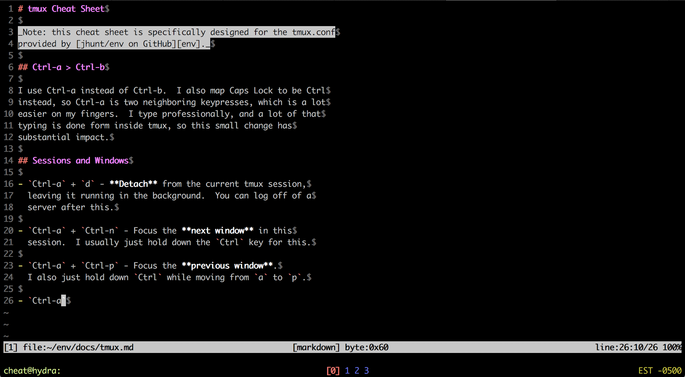
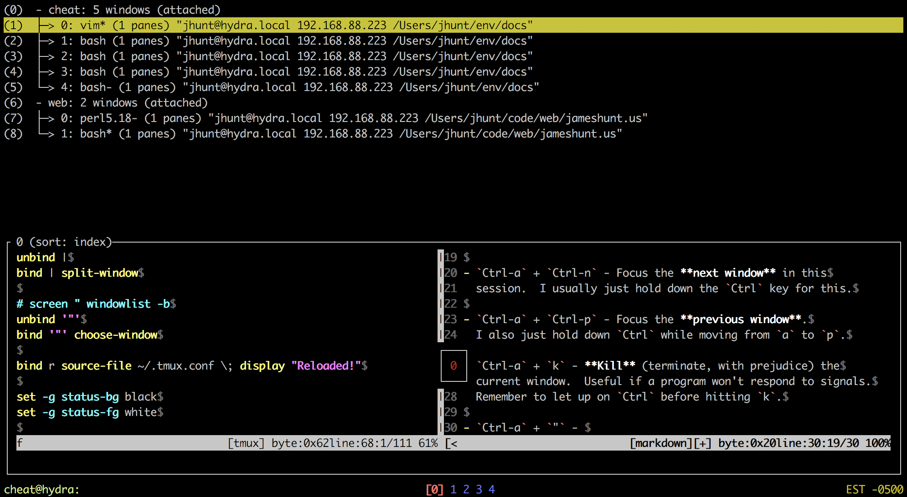
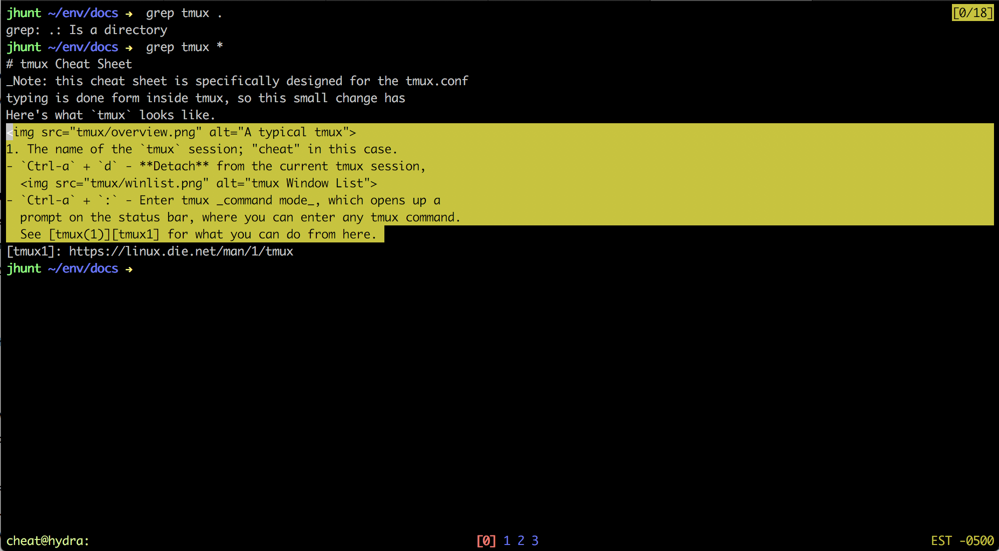

# tmux Cheat Sheet

_Note: this cheat sheet is specifically designed for the tmux.conf
provided by [jhunt/env on GitHub][env]._

## `Ctrl-a` > `Ctrl-b`

I use `Ctrl-a` instead of `Ctrl-b`.  I also map `Caps Lock` to be
`Ctrl` instead, so `Ctrl-a` is two neighboring keypresses, which
is a lot easier on my fingers.  I type professionally, and a lot
of that typing is done form inside tmux, so this small change has
substantial impact.

Here's what `tmux` looks like.

1. The name of the `tmux` session; "cheat" in this case.
2. The name of the host machine.  "hydra" is my laptop.
3. The window list (navigation).  I'm on window 0, currently.
4. The local host timezone.  Useful for interpreting log
   timestamps and such.

## Sessions and Windows

- `Ctrl-a` + `d` - **Detach** from the current tmux session,
  leaving it running in the background.  You can log off of a
  server after this.

- `Ctrl-a` + `Ctrl-n` - Focus the **next window** in this
  session.  I usually just hold down the `Ctrl` key for this.

- `Ctrl-a` + `Ctrl-p` - Focus the **previous window**.
  I also just hold down `Ctrl` while moving from `a` to `p`.

- `Ctrl-a` + `x` - **Kill** (terminate, with prejudice) the
  current window.  Useful if a program won't respond to signals.
  Remember to let up on `Ctrl` before hitting `x`.

- `Ctrl-a` + `"` - Open the **window list**, allowing you to
  select windows (with preview!)

  

## Splits and Panes

- `Ctrl-a` + `-` - **Vertically split** the current pane, focusing
  on the bottom pane.  The hyphen sort of looks like it could
  divide the window across the middle..

- `Ctrl-a` + `\\` - **Vertically split** the current pane, putting
  the new pane on the right.  `\\` is just a `|` without `Shift`
  held down, and `|` looks like it divides the window.  A bit of a
  stretch, I know, but it's a serviceable mnemonic.

- `Ctrl-a` + `←` or `Ctrl-a` + `h` - Move **left** to the pane next to this one.
- `Ctrl-a` + `↓` or `Ctrl-a` + `j` - Move **down** to the pane below.
- `Ctrl-a` + `↑` or `Ctrl-a` + `k` - Move **up** to the pane above.
- `Ctrl-a` + `→` or `Ctrl-a` + `l` - Move **right** to the pane next to this one.

## Scrollback Copy Mode

- `Ctrl-a` - `[` - Enter copy mode.

Inside copy mode, the following key sequences can be used:

- `Ctrl-u` - Scroll up by a page.
- `Ctrl-d` - Scroll down by a page.
- `←`, `↑`, `↓`, `→` - Move around in the buffer.

- `Space` - Start a copy highlight at the cursor.
  Exits copy mode.

- `Enter` - (after a `Space` and some movement commands) copy the
  highlighted text to the paste buffer.

- `Ctrl-a` - `]` - Paste the contents of the paste buffer to the
  terminal.  Often useful from within `vim`, under `set paste`.

- `Ctrl-c` - Exit copy mode.  Note the lack of `Ctrl-a` prefixing
  this particular key-sequence.

## More Advanced Stuff

- `Ctrl-a` + `Shift-s` - **SSH** somewhere, using the name or IP
  typed in at the `ssh:` prompt that appears in the status bar.
  A new window is created for running the SSH session, and the
  window exits when `ssh` terminates.

- `Ctrl-a` + `:` - Enter tmux _command mode_, which opens up a
  prompt on the status bar, where you can enter any tmux command.
  See [tmux(1)][tmux1] for what you can do from here.

[tmux1]: https://linux.die.net/man/1/tmux
